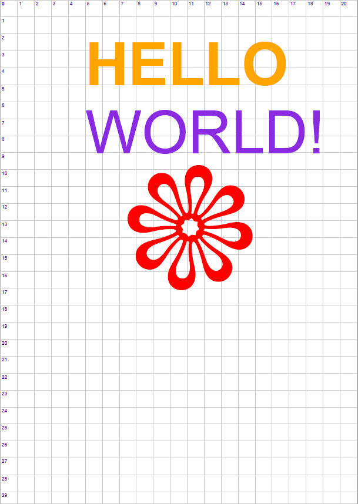
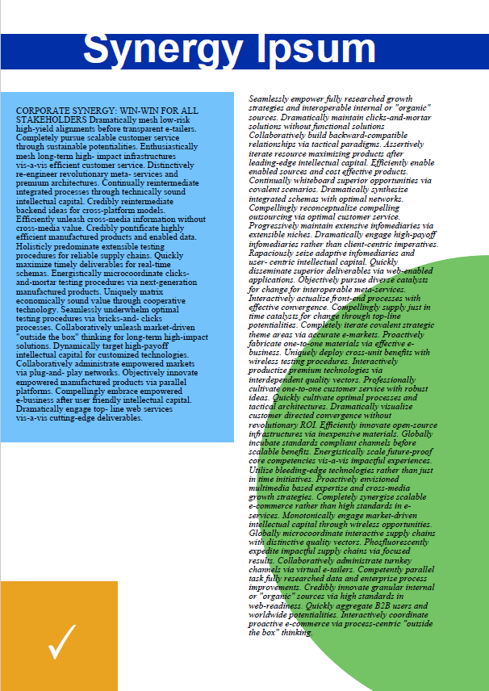

## one-file-pdf - A minimalist PDF generator in &lt;2K lines and 1 file
[](https://goreportcard.com/report/github.com/balacode/one-file-pdf)
[](https://travis-ci.org/balacode/one-file-pdf)
[](https://coveralls.io/github/balacode/one-file-pdf?branch=master)
[](https://gitter.im/one-file-pdf/Lobby)
[](https://godoc.org/github.com/balacode/one-file-pdf)
[](https://opensource.org/licenses/MIT)  

The main idea behind this project was:  
*"How small can I make a PDF generator for it to still be useful for 80% of common PDF generation needs?"*

The result is a single .go file with less than 1999 lines of code, about 400 of which are color and glyph-size constants, and ~350 are comments.

- All the basics for generating PDF documents, enough for generating mundane business reports.
- It's easier to learn about the internals of the PDF format with a small, concise library.
- The current version of the file is indicated in the header (the timestamp).

### To Install:  

```bash
    go get github.com/balacode/one-file-pdf
```

### Naming Convention:  
All types in are prefixed with PDF for public, and 'pdf' for private types.
The only type you need to use is PDF, while PDFColorNames are left public for reference.

### Features:  
- Use all built-in PDF fonts: Courier, Helvetica, Symbol, Times, ZapfDingbats, and their variants
- Recognises 144 web colo(u)r names, or any RGB value
- Stream compression can be turned on or off (PDF files normally compress streams to reduce file size, but turning it off helps in debugging or learning about PDF commands)
- Metadata properties: author, creator, keywords, subject and title
- Set the measurement units you want: mm, cm, inches, twips or points
- Draw lines with different thickness
- Filled or outline rectangles, circles and ellipses
- JPEG, GIF and transparent PNG images (filled with specified background color)
- Set columns for text (like tab stops on the page)
- Built-in grid option to help measurement and positioning

### Not Supported:  
- Unicode (requires font embedding)
- Font embedding
- PDF encryption
- Paths, curves and complex graphics

### Hello World:  

```go
package main 

import "fmt"
import "github.com/balacode/one-file-pdf"

func main() {
	fmt.Println(`Generating a "Hello World" PDF...`)

	// create a new PDF using 'A4' page size
	var pdf = pdf.NewPDF("A4")

	// set the measurement units to centimeters
	pdf.SetUnits("cm")

	// draw a grid to help us align stuff (just a guide, not necessary)
	pdf.DrawUnitGrid()

	// draw the word 'HELLO' in orange, using 100pt bold Helvetica font
	// - text is placed on top of, not below the Y-coordinate
	// - you can use method chaining
	pdf.SetFont("Helvetica-Bold", 100).
		SetXY(5, 5).
		SetColor("Orange").
		DrawText("HELLO")

	// draw the word 'WORLD' in blue-violet, using 100pt Helvetica font
	// note that here we use the colo(u)r hex code instead
	// of its name, using the CSS/HTML format: #RRGGBB
	pdf.SetXY(5, 9).
		SetColor("#8A2BE2").
		SetFont("Helvetica", 100).
		DrawText("WORLD!")

	// draw a flower icon using 300pt Zapf-Dingbats font
	pdf.SetX(7).SetY(17).
		SetColorRGB(255, 0, 0).
		SetFont("ZapfDingbats", 300).
		DrawText("a")

	// save the file:
	// if the file exists, it will be overwritten
	// if the file is in use, prints an error message
	pdf.SaveFile("hello.pdf")
} //                                                                        main
```

### Samples:

  

  

### Changelog (excluding internal changes):

**2018-MAR-08**
- New methods DrawCircle(), DrawEllipse(), FillCircle(), FillEllipse()
- New demo demonstrating circles and text wrapping: corporate.pdf ("Synergy Ipsum")
- SetColor(): now allows HTML color values like `"#4C9141 MayGreen"`, ignores the extra chars.
- Log an error when the name of a selected font is unknown.
- Log the specified measurement unit's name when its name is not valid.

**2018-MAR-09**
- Replaced PDFColor type with standard lib's color.RGBA (import "image/color")
- SetColorRGB(): changed parameters from int to uint8
- Changed PDFPageSize and PDFStandardPageSizes to private structures
- SaveFile() now returns `error` instead of `*PDF`, to allow caller to check for IO errors
- SetColumnWidths() is no longer limited to 100 columns
- Font names and color names can be specified with spaces, underscores or '-' delimiting words
- Removed module-global PDFErrorHandler, created SetErrorLogger() to set the handler for each PDF instance

**2018-MAR-14**
- Added support for color JPEG, GIF and PNG images with transparency blending
- Added all standard A, B, and C paper sizes, and US Tabloid and Ledger
- DrawImage(): added backColor optional parameter (using ...) so you can specify the background color for transparent PNGs
- DrawImage(): changed to draw images down from the Y-coordinate position (below, not above Y)
- Created "PNG Images Demo", which outputs to png_images.pdf
- Created ToColor() function to convert named colors and HTML color codes to RGBA color values
- Created ToUnits() method to convert points to the currently-active units of measurement
- Removed PDFNoPage constant
- Created basic unit tests and test helper functions
- Various internal changes, reducing file length by about 60 lines
